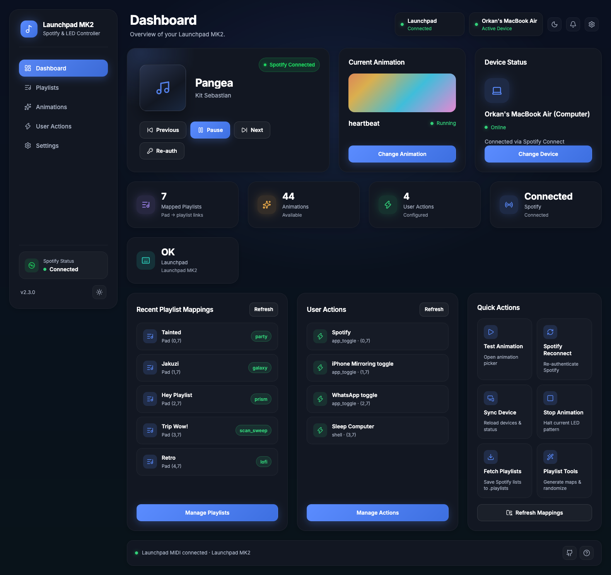

# Launchpad MK2 Spotify Controller

**Version:** 2.3.1

This project was created to repurpose an old Novation Launchpad MK2 as a Spotify controller. The script allows you to control Spotify playback and create LED animations through both direct interaction and HTTP requests, enabling integration with other applications.



*The web control panel was redesigned in **2.3.0** — a desktop-style dashboard with sidebar navigation, Now Playing hero, live stats, playlist mappings, user actions, and quick controls. It is also responsive for phones and tablets. **2.3.1** adds first-run Spotify credential setup and playlist tools directly in the panel.*


## Disclaimer
- This is a personal project created for my own use with an old Launchpad MK2
- Use this script at your own risk
- No warranty or guarantee is provided
- The code and documentation may have conflicts or inconsistencies
- If you encounter issues, please open a GitHub issue for discussion

### Features
- Spotify playlist, play/pause and next/previous control through Launchpad buttons
- LED animations controllable via HTTP requests
- Device selection for Spotify playback
- Customizable playlist mappings with animations
- **User 1 / User 2 modes** — custom pad actions (shell, URL, HTTP, app toggle, AppleScript) via the web panel
- Mode indicator LEDs that stay locked while Session / User modes are active
- Rich colorized terminal interface with help and status displays
- **Redesigned web control panel** — sidebar navigation, dashboard overview, dark/light theme, mobile-friendly layout
- **First-run Spotify setup in the web panel** — paste Client ID / Secret without editing `config/.secret` by hand
- Playlist tools in the web UI: fetch playlists, generate/replace mappings, randomize animations, clear all
- Enhanced playlist mapping preview with visual grid layout

## Updates

### 2.3.1 — First-run Spotify setup & playlist tools in the web panel (July 2026)

**Release notes**
- **Web Spotify credential setup**: after a fresh clone, missing `config/.secret` is created automatically from `config/sample.secret`
- Enter **Client ID / Client Secret** on the Dashboard setup banner or in **Settings → Spotify API Credentials** (no need to edit files by hand)
- **Save & Sign in** writes credentials then opens the Spotify OAuth flow
- Status / console alerts distinguish “credentials missing” from “token expired”
- **Playlist Tools** in the web panel (CLI equivalents):
  - Fetch Playlists (`p`) — save Spotify playlists to `.playlists`
  - Generate Mappings (`g`) — fill empty pads **or** replace all mappings
  - Randomize Animations (`r`) — shuffle animations on existing maps
- **Clear All** on the Playlist Mappings list

**First-run (clone → web)**
1. Start the controller (`python main.py`)
2. Open `http://127.0.0.1:5125/`
3. Paste Client ID + Secret from the [Spotify Developer Dashboard](https://developer.spotify.com/dashboard)
4. Click **Save & Sign in** (Redirect URI must be `http://127.0.0.1:5125/callback`)

**API**
- `GET/POST /api/spotify-credentials` — credential status (secret never returned) / save credentials
- `POST /api/playlists/fetch` — fetch & save playlists
- `POST /api/mapping/generate` — body `{ "filter": "newest|popular|all", "mode": "fill|replace" }`
- `POST /api/mapping/randomize-animations`
- `POST /api/mapping/clear-all`

### 2.3.0 — Web panel redesign & mobile layout (July 2026)

**Release notes**
- Full **UI/UX redesign** of the web control panel into a premium desktop-style app shell
- **Sidebar navigation**: Dashboard, Playlists, Animations, User Actions, Settings
- **Dashboard overview**: Now Playing hero, current animation, device status, stats, recent mappings, quick actions
- Modern design language: soft glass cards, Inter typography, Lucide icons, dark/light theme toggle
- **Responsive layout** for tablets and phones (drawer menu, stacked cards, touch-friendly controls)
- Existing Spotify, mapping, animation, audio-features, and user-action flows preserved (presentation-only change)
- **Auto-launch Spotify** (Settings): when enabled and the default device is this Mac, the Spotify desktop app is started automatically if it is closed when a device is needed
  - Can only be enabled while the saved default device is detected as this computer (`Computer` type matching this Mac’s name)
  - Changing/clearing the default device to a non-local device turns the option off automatically
  - Stored in `config/app_settings.json` (`GET/POST /api/app-settings`)
- **Launchpad MIDI health**: periodic checks detect when the pad is unplugged/unreachable; console warnings repeat until reconnect, dashboard shows disconnect state, and the app tries to reopen the MIDI ports automatically
- **Start without Launchpad**: the controller boots even if no MIDI device is present; connect the pad later and it will be picked up automatically
- **10 new animations**: `checker_pulse`, `spiral_trail`, `meteor_shower`, `plasma_field`, `binary_cascade`, `orbital_dots`, `scan_sweep`, `ember_rise`, `ripple_pool`, `vortex_spin`
- Mode pad LED locks (Session / User 1 / User 2) no longer get wiped by the MIDI health probe (programmer-mode SysEx removed from the connection check)

**How to open**
1. Start the controller (`python main.py`)
2. Open `http://127.0.0.1:5125/` in your browser

### 2.2.0 — User modes, mode LED locks & control remapping (July 2026)

**Release notes**
- **User 1 `(5,8)` / User 2 `(6,8)` action modes** — each profile has its own 8×8 action bank (separate from Spotify playlist mappings)
- Configure actions in the web panel (**User Mode Actions**): shell, open URL, HTTP request, macOS app toggle, AppleScript
- Mapping flow: fill the form → click **Map — then press Launchpad** → press a grid pad `(0–7, 0–7)` (top row and right column are reserved)
- Runtime: press User 1 or User 2 to enter the mode, then press a mapped grid pad to run the action; press the same User button again to exit
- Session / User 1 / User 2 are **mutually exclusive**; the active mode pad stays lit with a locked color (Session cyan, User 1 green, User 2 magenta) that animations cannot override
- **Play/Pause moved** from `(5,8)` to **`(8,0)`** (right column) to free User 1
- App toggle picker lists running macOS apps (optional background processes); you can still type a custom app name
- Storage: `config/user_actions.json` (see `config/sample.user_actions.json`)

**Breaking / muscle-memory change**
- Play/Pause is no longer on `(5,8)`. Use `(8,0)` instead.
- `(5,8)` and `(6,8)` are now User 1 / User 2 mode toggles.

**Web / API**
- UI section: **User Mode Actions** + **User Mode Mappings** list
- `GET /api/user-actions`, `POST /api/user-actions/start|cancel|delete|update`
- `GET /api/user-actions/status`, overwrite confirm/cancel endpoints
- `GET /api/user-actions/running-apps` — running app list for app toggle

### 2.1.0 — Spotify auth recovery & dashboard URI migration (July 2026)

**Release notes**
- Recover from revoked / invalid Spotify refresh tokens without restarting the whole app (`auth` command + web **Re-auth**)
- OAuth callback now uses the built-in web UI at `http://127.0.0.1:5125/callback` (welcome / success page)
- Clear console + Launchpad LED alerts when Spotify login is required (pad turns red)
- Audio features disabled by default (Spotify restricted `/audio-features` for most apps; 403 no longer breaks playback)
- Thread-safe Spotify API access to avoid intermittent `Access token missing` races
- Random LED animation when playback is not tied to a mapped playlist

**Action required for existing users (Spotify Developer Dashboard)**

Spotify tightened redirect URI rules. Old values like `http://localhost:8888/callback` or `https://localhost:8888/callback` are rejected (`Insecure` / `Not matching configuration`).

1. Open [Spotify Developer Dashboard](https://developer.spotify.com/dashboard) → your app → **Settings**
2. Under **Redirect URIs**, add exactly:
   ```
   http://127.0.0.1:5125/callback
   ```
3. Click **Add**, then **Save** at the bottom of the page
4. You may remove obsolete `localhost` / `:8888` URIs
5. Restart the controller and run `auth` (terminal) or **Re-auth** (web UI)

Notes:
- Use `127.0.0.1`, not `localhost`
- Local loopback may stay on `http://`; public apps need `https://`
- The redirect URI in the Dashboard must match the app exactly (same Client ID as in `config/.secret`)

See also: [Spotify Redirect URIs](https://developer.spotify.com/documentation/web-api/concepts/redirect_uri) and the [security requirements update](https://developer.spotify.com/blog/2025-02-12-increasing-the-security-requirements-for-integrating-with-spotify).

### 🎯 New Feature: Web-Based Playlist Mapping Editor (February 2026)

Create and manage playlist mappings directly from the web interface without editing JSON files!

**Features:**
- **Interactive Mapping Editor**
  - Select any playlist from your Spotify account
  - Optional animation selection during mapping
  - Press a button on your Launchpad to create the mapping
  - Real-time status feedback

- **Smart Button Validation**
  - System reserved buttons (top row y=8, right column x=8) are protected
  - Warning when overwriting existing mappings
  - Confirmation dialog before overwriting existing mappings
  - Automatic save on button press

- **Quick Animation Updates**
  - Animation dropdown for each mapping in the list
  - Change animations instantly without page reload
  - Visual feedback on successful updates
  - Delete mappings with one click

- **Default Device Management**
  - Select and save your default Spotify device from web interface
  - No need to manually edit `.secret` file
  - Device list shows active devices
  - Clear default device option

- **5 New Animations Added** 🎉
  - `aurora` - Aurora borealis effect with flowing green-blue waves
  - `galaxy` - Spiral galaxy effect with rotating arms
  - `neon_grid` - Neon grid pattern with pulsing lines
  - `lava_lamp` - Lava lamp effect with rising colorful blobs
  - `prism` - Prism effect with rainbow light refraction

**Usage:**
1. Open web interface at `http://127.0.0.1:5125/`
2. Open **Playlists** in the sidebar
3. Select a playlist and optional animation
4. Click "Map Button" and press a button on your Launchpad
5. Mapping is saved automatically!
6. Set default device in "Default Spotify Device" section

**Benefits:**
- No more manual JSON editing
- Faster mapping creation
- Visual feedback and error handling
- Easy animation management
- Web-based device configuration

## 🚀 Major Update: Refactored Architecture (September 2025)

### 📂 **New Modular Code Structure**
The monolithic 2,216-line `mk2.py` file has been completely refactored into a clean, maintainable architecture:

```
src/
├── animations/
├── core/
├── effects/
├── hardware/
├── services/
├── api/
├── utils/
└── main.py
```

### 🎨 **Enhanced Terminal Experience**
- **Rich colorized interface** using the Rich library
- **Smart help system**: Simple commands on startup, detailed help with `h` command
- **Beautiful status displays** with tables, colors, and emojis
- **Playlist mapping preview** with `v` command showing grid layout and utilization

### 🌐 **New Web Control Panel**
Access via `http://localhost:5125/` for:
- **🎵 Now Playing** - Current track display with play/pause controls
- **✨ Animation Control** - Dropdown selection with one-click start/stop
- **📊 Real-time Status** - Live stats for playlists, animations, Spotify connection
- **🎯 Playlist Mapping Editor** - Interactive playlist-to-button mapping without JSON editing
- **📋 Mapping Browser** - Visual preview of all playlist-animation mappings with quick animation updates
- **📱 Mobile-friendly** - Responsive design with glassmorphism UI

### 🎯 **Enhanced Commands**
- `h` - Beautiful colorized help with organized sections
- `v` - Preview playlist-animation mappings with visual table
- All existing commands enhanced with better formatting and feedback

### 🔧 **Technical Improvements**
- **Better error handling** - cleaner, more informative error messages
- **Improved logging** - Flask request logging disabled for cleaner console
- **Enhanced performance** - modular loading and efficient resource management
- **Future-ready** - easy to extend with new features and integrations

### 📋 **New API Endpoints**
- `GET /` - Modern web control panel
- `GET /status` - Real-time system status (JSON)
- `GET /mappings` - Playlist mappings with coordinates (JSON)
- `POST /play|/pause|/next|/previous` - Direct Spotify controls
- `GET /api/playlists` - Fetch user's Spotify playlists
- `POST /api/mapping/start` - Start mapping mode
- `POST /api/mapping/cancel` - Cancel mapping mode
- `GET /api/mapping/status` - Get mapping mode status
- `POST /api/mapping/delete` - Delete a mapping
- `POST /api/mapping/update-animation` - Update mapping animation

**Migration:** The refactored version maintains 100% compatibility with existing configurations and playlists. Simply run `python main.py` instead of `python mk2.py`.

### New Features (Latest) - 04/03/2025
- Added animation selection mode:
  - Press session button (4,8) to enter selection mode
  - Grid buttons (0,7 to 7,0) map to available animations
  - Press any grid button to instantly switch animations
  - Press session button again to exit selection mode
  - Visual guide in terminal shows which button activates each animation
- Added play/pause control (see **2.2.0**: now on `(8,0)`, not `(5,8)`)
- 5 More animations added

### New Features - 03/03/2025
- Added new mood-based animations:
  - `synthwave` - Retro synthwave style with sunset colors
  - `lofi` - Calm, smooth transitions for lo-fi music
  - `meditation` - Peaceful breathing effect for meditation
  - `party` - Energetic, colorful animation for party music
  - `focus` - Subtle, non-distracting for study/focus
- New 'r' command to randomize animations:
  - Randomly assigns animations to all playlists
  - Preserves existing mappings and coordinates
  - Shows before/after changes for each playlist
  - Updates playlists.json automatically

### New Features - 27/02/2025
- Automatic playlist mapping with 'g' command
  - Sort by newest playlists
  - Sort by most popular playlists
  - Sort by all playlists
  - Random animation assignment for new mappings (this action does not remove your existing records in playlists.json)
- Random playlist selection using mixer button (7,8)
- UTF-8 support for playlist names with emojis
- Config files moved to config folder

### Default Device Support - 04/12/2024
Added support for automatically using a default Spotify device when no active device is found.

To configure:
1. Add your preferred device ID to `.secret`:
```
client_id=YOUR_CLIENT_ID
client_secret=YOUR_CLIENT_SECRET
default_device_id=YOUR_DEFAULT_DEVICE_ID
```

2. To find your device ID:
   - Use the 'S' command to show available devices
   - Copy the ID of your preferred device
   - Add it to `.secret` as shown above

This fixes the "No active device found" error that occurred when:
- Spotify closes and opens
- No device was actively playing
- Multiple devices were available but none active

Note: Make sure Spotify is open on your default device for this to work properly.

### Real-time Spotify Integration
The controller maintains real-time synchronization with Spotify, detecting changes made from any source:

- Changes made in Spotify desktop/mobile app
- Third-party apps

When a playlist change is detected from any sources, the controller automatically:
1. Identifies the new playlist
2. Checks if it matches a configured playlist in `playlists.json`
3. Switches to the corresponding animation if configured
4. Detects play/pause state and stops animation or switches to last animation

This means you can control your music from anywhere, and the Launchpad will always stay in sync with the correct animation for your current playlist.

## Table of Contents
- [Getting Started](#getting-started)
  - [Prerequisites](#prerequisites)
  - [Installation](#installation)
- [Spotify Developer Setup](#spotify-developer-setup)
- [Configuration](#configuration)
  - [Playlist Configuration](#playlist-configuration)
- [Running the Script](#running-the-script)
- [Commands](#commands)
  - [Available Animations](#available-animations)
- [Web Interface](#web-interface)
- [Launchpad Layout](#launchpad-layout)
  - [Grid Reference](#grid-reference)
  - [Control Buttons](#control-buttons)
- [System Requirements & Compatibility](#system-requirements--compatibility)
  - [Tested Environment](#tested-environment)
  - [Important Notes](#important-notes)
  - [macOS Setup](#macos-setup)
  - [Known Issues](#known-issues)
- [Troubleshooting](#troubleshooting)
- [Files](#files)
- [Notes](#notes)
- [Running as a Service (macOS)](#running-as-a-service-macos)

## Getting Started

### Prerequisites

1. Python 3.6 or higher
2. Novation Launchpad MK2 (tested on MK2+)
3. Spotify Premium account
4. Spotify Developer account

## Installation

### Option 1: Direct Installation
1. Install required packages:
```bash
# macOS
brew install portaudio  # Required for audio processing
pip install -r requirements.txt

# Linux
sudo apt-get install python3-dev portaudio19-dev
pip install -r requirements.txt

# Windows
pip install -r requirements.txt  # No additional dependencies needed
```

2. Run the script:
```bash
python3 mk2.py
```

### Option 2: Using Virtual Environment (Recommended)
Virtual environments (venv) provide an isolated Python environment for your project. This is recommended because:
- Prevents conflicts between package versions
- Keeps your system Python clean
- Makes it easy to manage dependencies
- Ensures reproducible environments across different machines

1. Create and activate virtual environment:
```bash
# Navigate to project directory
cd path/to/Launchpad-MK2

# Create venv
python3 -m venv venv

# Activate venv
source venv/bin/activate  # On macOS/Linux
.\venv\Scripts\activate   # On Windows

# Your prompt should now show (venv) at the beginning
# Example: (venv) user@computer:~/Launchpad-MK2$
```

2. Install required packages:
```bash
# macOS
brew install portaudio  # Required for audio processing
pip install -r requirements.txt

# Linux
sudo apt-get install python3-dev portaudio19-dev
pip install -r requirements.txt

# Windows
pip install -r requirements.txt  # No additional dependencies needed

# Note: requirements.txt now includes Rich library for enhanced terminal interface
```

3. Run the script:
```bash
# New refactored version (recommended)
python main.py

# Or use the original file (legacy)
python3 mk2.py
```

4. When finished:
```bash
deactivate  # Exit virtual environment
```

### Using the Virtual Environment

Every time you want to run the script:
```bash
# Navigate to project directory
cd path/to/Launchpad-MK2

# Activate the virtual environment
source venv/bin/activate  # On macOS/Linux
.\venv\Scripts\activate   # On Windows

# Run the script
python3 mk2.py

# When done, deactivate the environment
deactivate
```

### Managing the Virtual Environment

Useful commands:
```bash
# Update pip in virtual environment
pip install --upgrade pip

# Show installed packages
pip list

# Export requirements (if you add new packages)
pip freeze > requirements.txt

# Remove virtual environment (if needed)
deactivate  # Make sure to deactivate first
rm -rf venv  # On macOS/Linux
rmdir /s /q venv  # On Windows
```

Note: The virtual environment directory (venv) is already in .gitignore, so it won't be committed to version control.

### System Requirements
- Python 3.7+
- Novation Launchpad MK2
- Spotify Premium account

### Troubleshooting Installation
If you encounter issues installing the requirements:

1. PyAudio Installation Fails:
   - Make sure you have the system dependencies installed first
   - Try installing portaudio before PyAudio

2. python-rtmidi Installation Fails:
   - macOS: Make sure Xcode command line tools are installed
   - Linux: Install libasound2-dev and libjack-dev
   ```bash
   sudo apt-get install libasound2-dev libjack-dev
   ```

3. Other Issues:
   - Make sure you have the latest pip: `pip install --upgrade pip`
   - Try installing requirements one by one to identify problematic packages

## Spotify Developer Setup

1. Create a Spotify Developer Account:
   - Go to [Spotify Developer Dashboard](https://developer.spotify.com/dashboard)
   - Log in with your Spotify account

2. Create a New Application:
   - Click "Create an App" button
   - Fill in the application details:
     - App name: (e.g., "Launchpad Controller")
     - App description: (e.g., "Launchpad MK2 Spotify Controller")
     - Redirect URI (exact): `http://127.0.0.1:5125/callback`
   - Click "Create"

3. Get Your Credentials:
   - Once created, you'll see your app in the dashboard
   - Click on your app to view settings
   - Note down the following:
     - Client ID
     - Client Secret (click "View Client Secret" to reveal)

4. Add Spotify credentials (pick one):
   - **Recommended — web panel (2.3.1+):** start the app, open `http://127.0.0.1:5125/`, paste Client ID + Secret into the setup form, click **Save & Sign in**
   - **Manual:** copy `config/sample.secret` → `config/.secret` (created automatically on first run if missing) and fill:
```
client_id=YOUR_CLIENT_ID
client_secret=YOUR_CLIENT_SECRET
```
   - Never share or commit `config/.secret` (it is gitignored)

5. Required Spotify Permissions:
   - Your app needs the following scopes:
     - `user-modify-playback-state`
     - `user-read-playback-state`
     - `playlist-read-private`
   - These are automatically requested during authentication

6. Re-authenticate when the token is revoked:
   - Terminal: type `auth` (or `reauth`)
   - Web UI: open `http://127.0.0.1:5125/` → **Re-auth** (or **Save & Sign in** if credentials are not set yet)
   - Browser opens Spotify login; after approval you should see the app’s callback page
   - If login fails with `redirect_uri: Not matching configuration` or `Insecure`, update the Dashboard URI as described in the **2.1.0** release notes above

[Source: Spotify Web API Getting Started Guide](https://developer.spotify.com/documentation/web-api/tutorials/getting-started)

## Configuration

### Playlist Configuration

Playlists are configured in `playlists.json`. The format is:

```json
{
    "mappings": {
        "x,y": {
            "name": "exact_playlist_name",
            "description": "Optional description",
            "animation": "rainbow"
        }
    }
}
```

Example configuration:
```json
{
    "mappings": {
        "0,7": {
            "name": "dream catcher",
            "description": "Bottom-left - Chill vibes",
            "animation": "pulse"
        },
        "0,0": {
            "name": "Trip",
            "description": "Top-left - Travel playlist",
            "animation": "classical"
        }
    }
}
```

  - [Grid Reference](#grid-reference)

To configure:
1. Use 'l' command to list available playlists
2. Copy exact playlist names
3. Edit playlists.json
4. New playlist mappings will be loaded automatically

Tips:
- Keep playlist names exactly as they appear in Spotify
- Use descriptions to remember what each button does

## Playlist Configuration

### playlists.json Format
The `playlists.json` file maps Launchpad buttons to Spotify playlists and optional animations. Each mapping contains:
- `name`: The exact name of your Spotify playlist
- `animation` (optional): The animation to play when this playlist starts

Example configuration:
```json
{
    "mappings": {
        "0,7": {
            "name": "My Workout Mix",
            "animation": "rainbow"
        },
        "1,7": {
            "name": "Chill Vibes",
            "animation": "pulse"
        },
        "2,7": {
            "name": "Party Playlist"
            // No animation specified - will keep current animation
        }
    }
}
```

Available animations:
- `rainbow`: Color wave effect
- `matrix`: Matrix-style falling effect
- `pulse`: Pulsing rings
- `sparkle`: Random sparkling lights
- `wipe`: Color wipe effect
- `snake`: Moving snake pattern
- `fireworks`: Firework explosions
- `rain`: Falling rain effect
- `wave`: Wave collision pattern

The animation will automatically change when you start the playlist. If no animation is specified, the current animation will continue playing.

## Running the Script

1. Connect your Launchpad MK2 to your computer
2. Open Spotify on your computer
3. Run the script:

```bash
python main.py
```

4. On first run (or after a revoked token):
   - Ensure Redirect URI `http://127.0.0.1:5125/callback` is saved in the Spotify Dashboard
   - Type `auth` in the terminal (or use **Re-auth** in the web UI)
   - Log in to Spotify and grant permissions
   - You should land on the app’s callback / welcome page — no URL paste required

## Commands

| Command | Description |
|---------|-------------|
| **`h`** | 🎨 **Show detailed colorized help** with hardware controls and tips |
| **`v`** | 📋 **Preview playlist-animation mappings** with visual grid layout |
| `auth` | 🔐 Re-authenticate Spotify (fix revoked / invalid refresh tokens) |
| `s` | 📱 Show and select available Spotify devices |
| `p` | 📥 Fetch and save your Spotify playlists to `.playlists` file |
| `l` | 📋 List all available playlists |
| `a` | 🎨 List and start animations manually |
| `x` | ⏹️ Stop current animation |
| `g` | 🤖 Generate playlist mappings automatically |
| `r` | 🎲 Randomize animations for all playlists |
| `q` | 🚪 Quit the application |

### 🎯 **New Enhanced Commands:**
- **`h`** - Beautiful Rich-formatted help with organized sections:
  - Hardware button reference for Launchpad controls
  - Web interface endpoints and features
  - Pro tips and troubleshooting
- **`v`** - Visual playlist mapping preview:
  - Grid layout showing coordinates and assignments
  - Animation status indicators
  - Grid utilization statistics

### 💡 **Command Tips:**
- On startup, you'll see a **Quick Status** display with essential information
- Use `h` for comprehensive help when you need detailed guidance
- Use `v` to quickly verify your playlist mappings and find empty slots

### Available Animations
- `rainbow` - Rainbow wave pattern
- `matrix` - Matrix-style falling characters
- `pulse` - Pulsing rings of light
- `sparkle` - Random twinkling lights
- `wipe` - Color wipe transitions
- `snake` - Moving snake pattern
- `fireworks` - Exploding firework effects
- `rain` - Falling rain effect
- `wave` - Colliding wave patterns
- `equalizer`: equalizer_animation,

### Genre-based animations

- `electronic`: electronic_animation,
- `classical`: classical_animation,
- `rock`: rock_animation,
- `jazz`: jazz_animation,
- `ambient`: ambient_animation,

### Mood-based animations
- `synthwave`
- `lofi`
- `meditation`
- `party`
- `focus`

### Artistic animations
- `starfield` - Twinkling stars in space
- `geometric` - Forming and transforming geometric shapes
- `sunset` - Sunset gradient with fade to night
- `heartbeat` - Pulsing heart animation
- `bloom` - Flower blooming from center
- `aurora` - Aurora borealis effect with flowing green-blue waves
- `galaxy` - Spiral galaxy effect with rotating arms
- `neon_grid` - Neon grid pattern with pulsing lines
- `lava_lamp` - Lava lamp effect with rising colorful blobs
- `prism` - Prism effect with rainbow light refraction

You can start animations either through:
1. Command line: Use 'a' to list and select animations
2. Web interface: Visit `http://localhost:5125/animation/<name>`
3. Stop any running animation with the 'x' command

## 🌐 Web Interface

### 🎮 **Redesigned Control Panel (2.3.0)**
Visit **`http://127.0.0.1:5125`** for the updated desktop-style web panel:


- **Sidebar app shell**
  - Dashboard, Playlists, Animations, User Actions, Settings
  - Spotify connection status + dark/light theme toggle
  - Drawer navigation on mobile

- **Dashboard**
  - Now Playing hero with playback + Re-auth
  - First-run **Spotify API credentials** form when `config/.secret` is empty
  - Current animation / device status cards
  - Live stats (mapped playlists, animations, user actions, Spotify)
  - Recent mappings, user actions preview, and quick actions

- **Playlists**
  - **Playlist Tools**: fetch playlists, generate mappings (fill empty / replace all), randomize animations
  - Mapping editor + full mappings list with animation dropdowns, delete, and **Clear All**

- **Animations**
  - Start/stop animations
  - Audio features controls and live feature readout

- **User Mode Actions** (since 2.2.0)
  - Configure shell / URL / HTTP / app toggle / AppleScript actions per User 1 or User 2 bank
  - Click **Map — then press Launchpad**, then press a grid pad to assign
  - Pick running macOS apps for app toggle (or type a name)
  - List, edit, and delete mapped actions

- **Settings**
  - Spotify API Credentials (Client ID / Secret) + Save & Sign in
  - Default Spotify device
  - Auto-launch Spotify when closed (only if default device is this Mac)
  - Re-auth + appearance controls

### 📋 **API Endpoints**

#### 🎨 Animation Control
- `GET /` - Modern web control panel (HTML interface)
- `GET /animation/<name>` - Start an animation
- `GET /stop` - Stop current animation
- `GET /list` - List available animations (JSON)

#### 🎧 Spotify Control
- `GET /devices` - List available Spotify devices (JSON)
- `GET /device/<id>` - Select Spotify device by ID
- `POST /play` - Start playback
- `POST /pause` - Pause playback
- `POST /next` - Next track
- `POST /previous` - Previous track
- `GET /api/spotify-credentials` - Whether credentials are configured (secret never returned)
- `POST /api/spotify-credentials` - Save Client ID / Secret to `config/.secret`

#### 🎵 Playlist Tools & Mapping
- `GET /api/playlists` - List Spotify playlists
- `POST /api/playlists/fetch` - Fetch and save playlists to `.playlists`
- `POST /api/mapping/generate` - Auto-map pads (`filter`, `mode=fill|replace`)
- `POST /api/mapping/randomize-animations` - Shuffle animations on all mappings
- `POST /api/mapping/clear-all` - Remove every playlist mapping
- `POST /api/mapping/start|cancel|delete|update-animation` - Interactive mapping editor APIs

#### 👤 User Mode Actions
- `GET /api/user-actions` - List User 1 / User 2 action banks (`?profile=user1|user2`)
- `POST /api/user-actions/start` - Start pad capture for an action
- `POST /api/user-actions/cancel` - Cancel pad capture
- `GET /api/user-actions/status` - Mapping status + last action message
- `POST /api/user-actions/delete` - Delete an action `{profile,x,y}`
- `POST /api/user-actions/update` - Update an action without remapping
- `GET /api/user-actions/running-apps` - Running macOS apps (`?background=1` optional)

#### ⚙️ App Settings
- `GET /api/app-settings` - Auto-launch Spotify flag + whether it can be enabled
- `POST /api/app-settings` - Body `{ "auto_launch_spotify": true|false }`

#### 📊 Status & Data
- `GET /status` - Real-time system status (JSON; includes `credentials_configured` / `setup_required`)
- `GET /mappings` - Playlist mappings with coordinates (JSON)

### 💻 **Command Line Examples**
```bash
# Get current system status
curl http://localhost:5125/status

# Get playlist mappings
curl http://localhost:5125/mappings

# Start rainbow animation
curl http://localhost:5125/animation/rainbow

# Control Spotify playback
curl -X POST http://localhost:5125/play
curl -X POST http://localhost:5125/pause

# List Spotify devices
curl http://localhost:5125/devices
```

### 📱 **Responsive (2.3.0)**
The redesigned panel adapts to:
- **Phones** — hamburger drawer menu, stacked cards, touch-friendly controls
- **Tablets** — two-column layouts where space allows
- **Desktops** — full sidebar + dashboard composition

## Launchpad Layout

### Grid Reference
The Launchpad MK2 has a 9x9 grid layout. The coordinate system works as follows:

```
   0   1   2   3   4   5   6   7   8  (x)
8  +   -   <   >   □   ▶   ■   □   S   Controls
7  □   □   □   □   □   □   □   □   ▷   Playlists
6  □   □   □   □   □   □   □   □   ▷
5  □   □   □   □   □   □   □   □   ▷
4  □   □   □   □   □   □   □   □   ▷
3  □   □   □   □   □   □   □   □   ▷
2  □   □   □   □   □   □   □   □   ▷
1  □   □   □   □   □   □   □   □   ▷
0  □   □   □   □   □   □   □   □   ▷
(y)
```

- x increases from left to right (0-8)
- y decreases from top to bottom (8-0)
- Upper row is y=8 (for special functions)
- Main playlist buttons are typically on row y=7
- The right column (x=8) contains control buttons (▷)

Example coordinates:
- Top row buttons: (0,8), (1,8), etc.
- First playlist position: (0,7)
- Second playlist position: (1,7)
- Third playlist position: (2,7)
- Spotify device selection: (8,8)

When configuring your playlists.json, use these coordinates:
```json
{
    "mappings": {
        "0,7": {
            "name": "First Playlist",
            "animation": "rainbow"
        },
        "1,7": {
            "name": "Second Playlist",
            "animation": "matrix"
        }
    }
}
```

### Control Buttons
- Volume Up `(0,8)`
- Volume Down `(1,8)`
- Previous Track `(2,8)`
- Next Track `(3,8)`
- Animation Selection Mode / Session `(4,8)` — locked cyan LED while active
- User 1 Mode `(5,8)` — locked green LED while active
- User 2 Mode `(6,8)` — locked magenta LED while active
- Random Playlist `(7,8)`
- Play/Pause `(8,0)` — right column

**Mode notes**
- Session, User 1, and User 2 are mutually exclusive (entering one exits the others)
- In User modes, grid pads `(0–7, 0–7)` run custom actions from `config/user_actions.json`
- Configure / map actions from the web panel at `http://127.0.0.1:5125/` → **User Actions**

## System Requirements & Compatibility

### Tested Environment
- macOS Sonoma 15.1.1
- Python 3.6 or higher
- Novation Launchpad MK2 (tested on MK2+)
- Spotify Premium account

### Important Notes
- Primary development and testing was done on macOS
- Other operating systems may require additional setup or have different behavior
- If using Windows or Linux, MIDI device setup process might differ

### macOS Setup
1. Open 'Audio MIDI Setup' application
2. Go to Window > Show MIDI Studio
3. Ensure Launchpad MK2 is visible and enabled
4. Connect Launchpad before starting the script

### Known Issues
- If Launchpad is not recognized:
  - Try unplugging and replugging the device
  - Restart the Audio MIDI Setup application
  - Ensure no other applications are using the Launchpad

If you successfully run this on other operating systems, please let me know so I can update the compatibility list.

## Notes

- Requires Spotify Premium for playback control
- Playlist names are case-insensitive but must otherwise match exactly
- The script must be run from a terminal that can handle input commands

## Running as a Service (macOS)

You can set up the script to run automatically on macOS startup:

1. Edit the service file:
   ```bash
   # Create a copy of the plist file
   cp com.launchpad.spotify.plist ~/Library/LaunchAgents/
   ```

2. Edit the plist file to match your system:
   - Replace `/full/path/to/your/mk2.py` with the actual path to your script
   - Replace `YOUR_USERNAME` with your macOS username
   - Update the `WorkingDirectory` to match your script's location

3. Set proper permissions:
   ```bash
   chmod 644 ~/Library/LaunchAgents/com.launchpad.spotify.plist
   ```

4. Load the service:
   ```bash
   launchctl load ~/Library/LaunchAgents/com.launchpad.spotify.plist
   ```

5. Start the service:
   ```bash
   launchctl start com.launchpad.spotify
   ```

<!-- ### Service Management Commands
```bash
# Start the service
launchctl start com.launchpad.spotify

# Stop the service
launchctl stop com.launchpad.spotify

# Unload the service (remove from startup)
launchctl unload ~/Library/LaunchAgents/com.launchpad.spotify.plist

# Check service status
launchctl list | grep launchpad

# View logs
tail -f ~/Library/Logs/launchpad_spotify.log
tail -f ~/Library/Logs/launchpad_spotify_error.log
``` -->

### Important Notes
- Make sure all setup steps (Spotify authentication, etc.) are completed before running as a service
- The service will start automatically on system boot
- Logs are stored in `~/Library/Logs/`
- If you update the script, restart the service for changes to take effect
